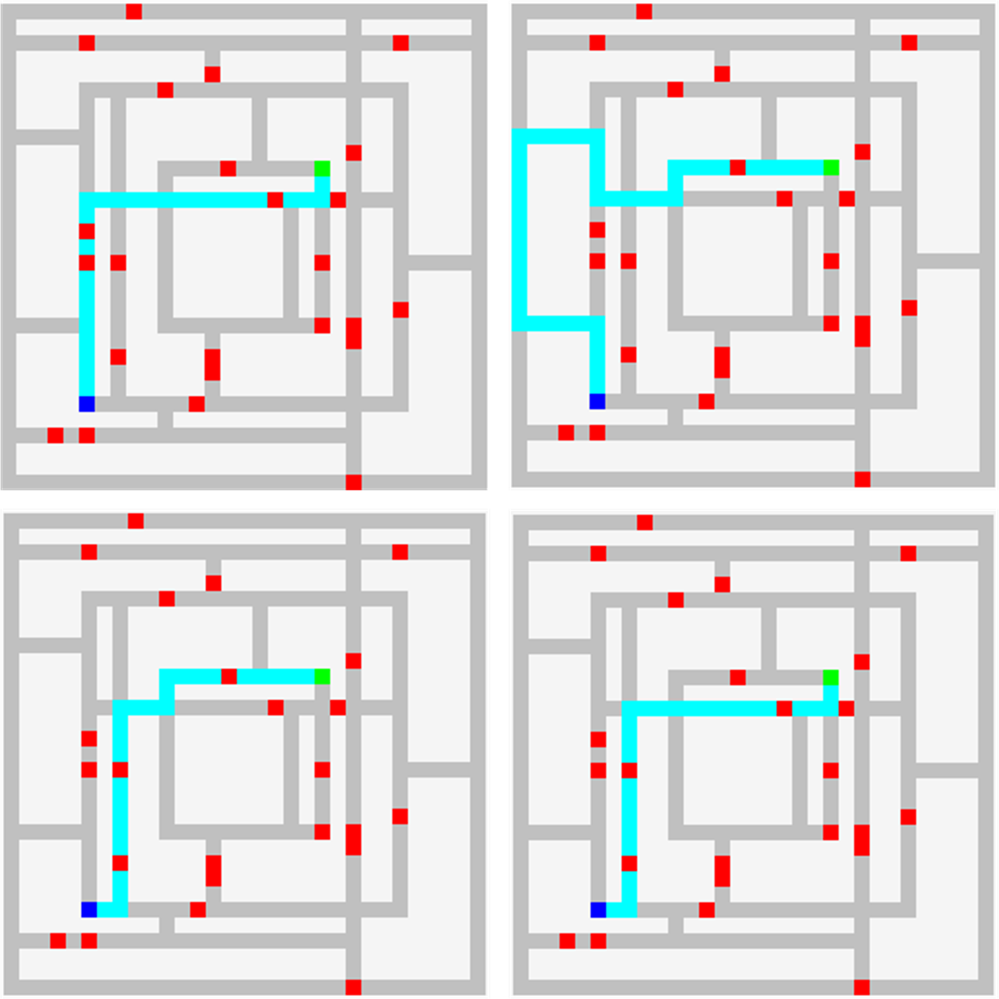

# Constraint Dominance Principle based Multi-objective Evolutionary Algorithm for Multimodal Multi-objective Multi-point Shortest Path Planning Problem

* Multi-modal multi-objective path planning needs to satisfy the feasibility of the solutions, convergence and diversity in the decision space and objective space at the same time. In this study, a multi-modal multi-objective evolutionary algorithm based on the constraint dominance principle (MMOEA-CDP) is proposed. A constraint dominance principle-based path comparison strategy is proposed to balance the convergence and feasibility, so that the population can pass through the discontinuous large infeasible regions and reach the constrained Pareto front (CPF). A path similarity-based multi-modal solutions selection method is proposed to balance the convergence of the population and the diversity in the decision space. A key point map modeling method is proposed, which can reduce the encoding length of the path without ignoring the map information, thereby reducing the difficulty and scale of the optimization problem.
* Key word : Constrained multi-objective optimization; Multi-modal multi-objective optimization, Multi-objective evolutionary algorithm, Multi-objective path planning.

