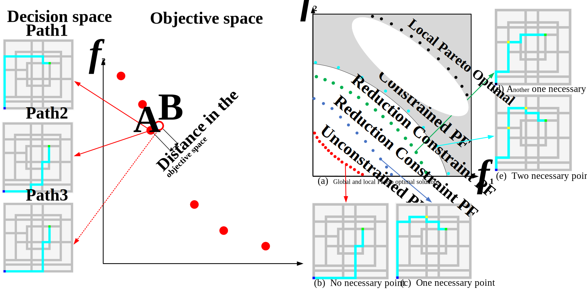

# Multi-Objective Optimization for Multimodal Multi-Objective Multi-Point Shortest Path Problem Considering Unforeseeable Road Eventualities

- `Zhiwei Xu(许志伟)` \*, Kai Zhang, Javier Del Ser, Miqing Li, Xin Xu, Juanjuan He, Ni Wu.Multi-Objective Optimization for Multimodal Multi-Objective Multi-Point Shortest Path Problem Considering Unforeseeable Road Eventualities. *IEEE Transactions on Intelligent Transportation Systems* , pp. 1–19, 2025 (JCR: Q1; IF: 7.9)  
[[Link]](https://ieeexplore.ieee.org/document/10959009/) [[Download]](https://jaywayxu.github.io/PDF/MMOEA-CDP.pdf) [[Code]](https://github.com/JaywayXu/MMOEA-CDP)

- Multi-objective multi-point shortest path planning problems are commonly encountered in real-world applications. Numerous path planning algorithms have been proposed to accommodate different model assumptions. However, most existing algorithms can only identify a subset of the Pareto optimal paths and overlook equivalent Pareto optimal paths. Relying solely on a subset of Pareto optimal solutions is insufficient to effectively respond to unforeseeable road eventualities in the real-world traffic environment.
- In this paper, multi-objective multi-point shortest path planning problem is modeled as a multimodal multi-objective optimization problem with necessary points constrains. A multimodal multi-objective evolutionary algorithm using constraint dominance principle-based path comparison strategy and path similarity-based multimodal solutions selection strategy is proposed to address this problem.
- The proposed constraint dominance principle-based path comparison strategy can effectively navigate through large infeasible regions by relaxing necessary point constraints, thereby obtaining a true constrained Pareto front. The proposed path similarity-based multimodal solutions selection strategy can effectively balance the distribution of solutions in the decision space, thereby preserving multiple equivalent optimal solutions. The proposed algorithm is compared with five state-of-the-art path planning algorithms from the benchmark test suite derived from the 2021 IEEE CEC path planning competition, where city maps are adapted from real transportation networks in Chinese cities, in our experiments. The exceptional performance is demonstrated through thirty independent runs, yielding experimental results that showcase the superiority of the proposed algorithm on the test problem set. This superior performance highlights the potential for designing more resilient path planners suitable for scenarios affected by unpredictable road eventualities.
* Key word : Multi-objective shortest path planning, constrained multi-objective optimization, multimodal multi-objective optimization, multi-objective evolutionary algorithm.

